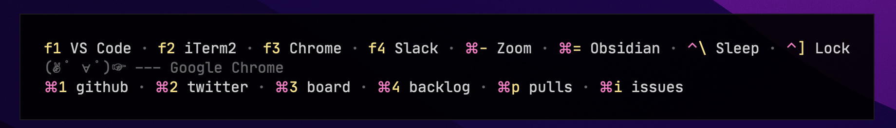
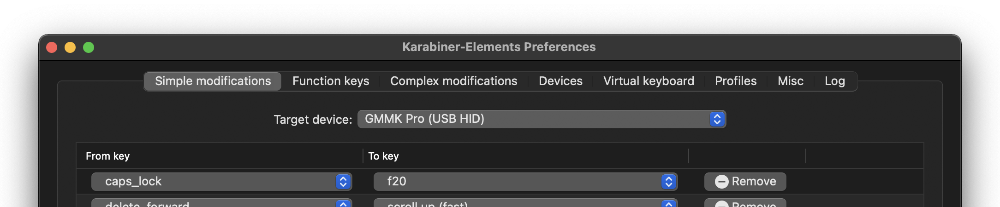

# AwesomeKeys

AwesomeKeys is a plugin for [Hammerspoon](https://www.hammerspoon.org/), that allows customizing global and app-specific key bindings.



### Installation

Download [`AwesomeKeys.zip`](https://github.com/mobily/awesome-keys/releases/download/v1.0.0/AwesomeKeys-v1.0.0.spoon.zip), unzip and open `AwesomeKeys.spoon` (it will auto-install the spoon).

Add the following to your the Hammerspoon config file (`init.lua`):

```lua
hs.loadSpoon("AwesomeKeys")
```

### Usage

Initialization.

```lua
hs.loadSpoon("AwesomeKeys")

local keys = spoon.AwesomeKeys
```

Set global key bindings.

```lua
keys:setGlobalBindings(
  {key = "f5", fn = keys.fnutils.keyStroke({"command", "shift"}, "4")},
  {key = "f6", fn = keys.fnutils.keyStroke({"command", "shift"}, "5")},
  {
    key = "f7",
    fn = function()
      local result =
        hs.dialog.blockAlert("Hammerspoon", "You're aboout to reload hammerspoon config, are you sure?", "OK", "Cancel")

      if result == "OK" then
        hs.reload()
      end
    end
  },
  {key = "f8", fn = keys.fnutils.keyStroke({"command", "option"}, "space")},
  {
    key = "f10",
    fn = function()
      hs.spotify.previous()
    end
  },
  {
    key = "f11",
    fn = function()
      hs.spotify.playpause()
    end
  },
  {
    key = "f12",
    fn = function()
      hs.spotify.next()
    end
  }
)
```

Set custom app-specific key bindings.

```lua
keys:remapAppKeys(
  {
    app = "Code",
    keys = {
      {from = {key = "end"}, to = {mods = {"command"}, key = "down"}},
      {from = {key = "home"}, to = {mods = {"command"}, key = "up"}}
    }
  }
)
```

Activate a hyper mode. See more options [here](#spoonawesomekeyscreatehyperbindingsconfig).

You can use [Karabiner](https://karabiner-elements.pqrs.org/) to map the caps lock key (or any other key that you rarely use) to `F20` (or anything else).



```lua
local hyper =
  keys:createHyperBindings(
  {
    hyperKey = "f20",
    backgroundColor = {hex = "#000", alpha = 0.9},
    textColor = {hex = "#FFF", alpha = 0.8},
    modsColor = {hex = "#FA58B6"},
    keyColor = {hex = "#f5d76b"},
    fontFamily = "JetBrains Mono",
    separator = "(✌ ﾟ ∀ ﾟ)☞ –––",
    position = {x = "center", y = "bottom"}
  }
)
```

Set global key bindings once the hyper mode is active.

```lua
hyper:setGlobalBindings(
  {
    key = "f1",
    label = "VS Code",
    fn = keys.fnutils.focusApp("Code")
  },
  {
    key = "f2",
    label = "iTerm2",
    fn = keys.fnutils.focusApp("iTerm")
  },
  {
    key = "f3",
    label = "Chrome",
    fn = keys.fnutils.focusApp("Google Chrome")
  },
  {
    key = "f4",
    label = "Slack",
    fn = keys.fnutils.focusApp("Slack")
  },
  {
    mods = {"command"},
    key = "-",
    label = "Zoom",
    fn = keys.fnutils.focusApp("zoom.us")
  },
  {
    mods = {"command"},
    key = "=",
    label = "Obsidian",
    fn = keys.fnutils.focusApp("Obsidian")
  },
  {
    mods = {"control"},
    key = "\\",
    label = "Sleep",
    fn = function()
      hs.caffeinate.systemSleep()
    end
  },
  {
    mods = {"control"},
    key = "]",
    label = "Lock",
    fn = function()
      hs.caffeinate.lockScreen()
    end
  }
)
```

Set app-specific key bindings once the hyper mode is active.

```lua
hyper:setAppBindings(
  {
    app = "Code",
    splitEvery = 8,
    keys = {
       {
        mods = {"command"},
        key = "1",
        label = "import react",
        fn = keys.fnutils.paste("import * as React from 'react'\n"),
        pattern = ".[t|j]sx?"
      },
      {
        mods = {"command"},
        key = "2",
        label = "import ts-belt",
        fn = keys.fnutils.paste("import { A } from '@mobily/ts-belt'\n"),
        pattern = ".[t|j]sx?"
      }
    }
  },
  {
    app = "iTerm",
    keys = {
      {
        mods = {"option"},
        key = "1",
        label = "start android",
        fn = keys.fnutils.paste("yarn start:android"),
        pattern = "/native"
      },
      {
        mods = {"option"},
        key = "2",
        label = "start ios",
        fn = keys.fnutils.paste("yarn start:ios"),
        pattern = "/native"
      }
    }
  },
  {
    app = "Google Chrome",
    keys = {
      {
        mods = {"command"},
        key = "p",
        label = "pulls",
        fn = keys.fnutils.openURL("https://github.com/pulls/assigned")
      },
      {
        mods = {"command"},
        key = "i",
        label = "issues",
        fn = keys.fnutils.openURL("https://github.com/issues/assigned")
      }
    }
  },
  {
    app = "Slack",
    keys = {
      {
        mods = {"option"},
        key = "1",
        label = "👀",
        fn = keys.fnutils.paste("👀")
      },
      {
        mods = {"option"},
        key = "2",
        label = "😂",
        fn = keys.fnutils.paste("😂")
      },
      {
        mods = {"option"},
        key = "3",
        label = "❤️",
        fn = keys.fnutils.paste("❤️")
      }
    }
  }
)
```

### API

#### `spoon.AwesomeKeys:setGlobalBindings(...)`

- `type`: function
- `parameters`: `...`

```lua
{
  mods = {} -- a table containing the keyboard modifiers: "command", "cmd", "control", "ctrl", "option", "shift" (optjonal)
  key = "",
  fn = function()
  end
}
```

#### `spoon.AwesomeKeys:remapAppKeys(...)`

- `type`: function
- `parameters`: `...`

```lua
{
  app = "", -- an app name as seen in the menubar
  keys = {
    {
      from = {
        mods = {}, -- a table containing the keyboard modifiers
        key = ""
      },
      to = {
        mods = {}, -- a table containing the keyboard modifiers
        key = ""
      }
    }
  }
}
```

#### `spoon.AwesomeKeys.createHyperBindings(config)`

- `type`: constructor
- `parameters`: config

```lua
{
  hyperKey = "f20" -- a key that activates the hyper mode
  strokeWidth = 2,
  strokeColor = {white = 1, alpha = 0.1}, -- hs.drawing.color
  backgroundColor = {hex = "#000", alpha = 0.9}, -- hs.drawing.color
  textColor = {hex = "#fff", alpha = 0.8}, -- hs.drawing.color
  modsColor = {hex = "#FA58B6"}, -- hs.drawing.color
  keyColor = {hex = "#f5d76b"}, -- hs.drawing.color
  fontFamily = ".AppleSystemUIFont",
  fontSize = 15,
  radius = 0,
  padding = 24,
  position = {x = "center", y = "bottom", offsetY = 8, offsetX = 8} -- x: left/center/right, y: top/center/bottom,
  spacer = " · ", -- a string visible between labels
  separator = "———", -- a string visible between global and app-specific key bindings
  splitEvery = 6,
  onEnter = function() -- a function that is called when the hyper mode is activated
  end,
  onExit = function() -- a function that is called when the hyper mode is deactivated
  end
}
```

#### `hyper:setGlobalBindings(...)`

- `type`: method
- `parameters`: `...`

```lua
{
  mods = {}, -- optional
  key = "",
  label = "", -- a key shortcut label
  fn = function()
  end
}
```

#### `hyper:setAppBindings(...)`

- `type`: method
- `parameters`: `...`

```lua
{
  app = "", -- an app name
  keys = {
    {
      splitEvery = 6, -- optional, overrides a value passed to `createHyperBindings`
      mods = {}, -- optional
      key = "",
      label = "",  -- a key shortcut label
      fn = function()
      end,
      pattern = "" -- (de)activate a shortcut on window title change (internally it uses string.match)
    }
  }
}

```
#### `spoon.AwesomeKeys.fnutils.openURL(url)`

- `type`: function
- `parameters`: url (string)

#### `spoon.AwesomeKeys.fnutils.paste(text)`

- `type`: function
- `parameters`: text (string)

#### `spoon.AwesomeKeys.fnutils.focusApp(name)`

- `type`: function
- `parameters`: name (string)

#### `spoon.AwesomeKeys.fnutils.keyStroke(mods, key)`

- `type`: function
- `parameters`: mods (table), key (string)
